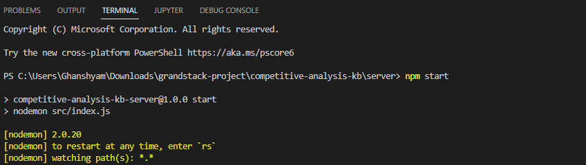
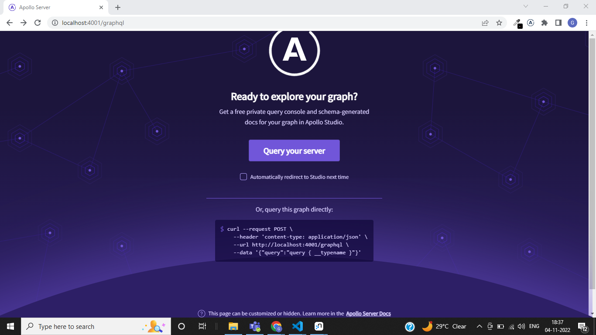
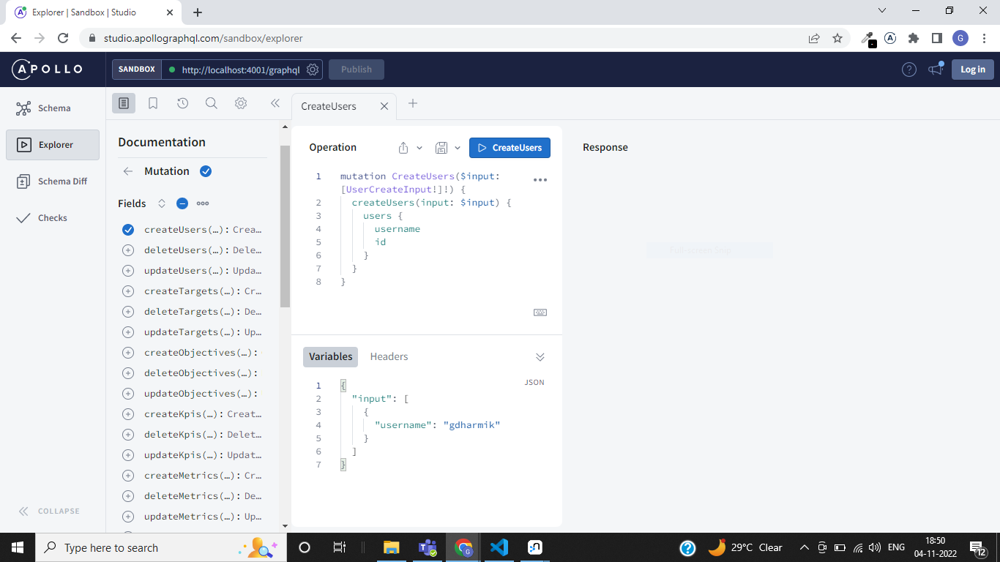

# competitive-analysis-kb

## Quick Start 

### Go inside the "Server" folder and then follow following command :
---


---

Install dependencies:

```
npm install
```

Start the GraphQL service:

```
npm start
```

This will start the GraphQL service (by default on localhost:4000) where you can issue GraphQL requests: 

---


---

Access GraphQL Playground in the browser:

---


---

## Configure

Set your Neo4j connection string and credentials in `.env`. For example:

_.env_

```
NEO4J_URI=bolt://localhost:7687
NEO4J_USER=neo4j
NEO4J_PASSWORD=letmein
AUTH_DIRECTIVES_ROLE_KEY=https://<auth0domain_OR_Custom_Auth_Doamin>/role
JWT_SECRET="-----BEGIN PUBLIC KEY-----<ACTUAL_PUBLIC_KEY_CONTENT_WITH_CRLF>-----END PUBLIC KEY-----"
```

Note:- You can download [Neo4j Desktop](https://neo4j.com/download/) and run locally for development